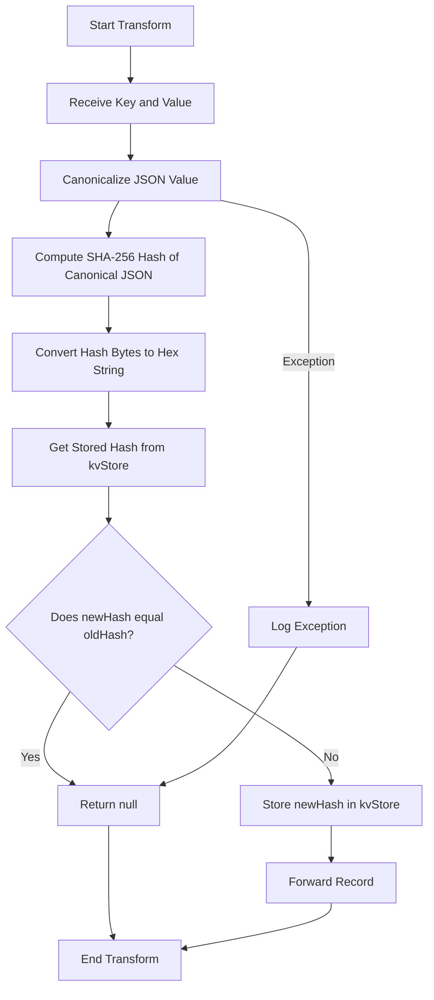

# ks-dedup

This project uses Quarkus, the Supersonic Subatomic Java Framework.

If you want to learn more about Quarkus, please visit its website: <https://quarkus.io/>.




## deduplication variants

### as ValueTransformerWithKey - for JSON and Avro values

`JsonDeduplicationTransformer` && `AvroDeduplicationTransformer`

Transformers need to return a value, so we return a `null` on duplicates, but also on errors. 
We could design to return a specialied `Result` object with more options instead.

Any of these options requires a further step to evaluate - filter out `null`s or process `Result`s. 

### as FixedKeyProcessor

`AvroDeduplicationProcessor`

Processors are more flexible than transformers, as they can selectively forward to any child processor. This has a couple of benefits:

* removes the need to filter the results, as was needed with a transformer
* adds routing - see example, where errors are routed to a DLQ directly from the processor

see `AvroDeduplicationDLQProcessor`

### Further work

There are many more options for deduplication - 

* Windowed deduplication - currently, only strictly sequential duplicates are caught. Oscillating values are not. We could store a list of values and remove old ones on update for with a punctuator.

* Deduplication by reduced value - party of our value coudl be irrelevant for identifying duplicates, e.g. timestamps. We could adapt our cacnoicalization to remove certain fields or types. 


### Canonicalization

Our idea of duplicates are same values fo rsame keys, even for nested values.

Be aware that the custom canonicalization for Avro, has not been thoroughly tested. I assume the JSON one was by its author.  

Easy for JSON, there are libs to do that: https://github.com/erdtman/java-json-canonicalization

```java
import org.erdtman.jcs.JsonCanonicalizer;            

JsonCanonicalizer jc = new JsonCanonicalizer(value);
String canonicalJson = jc.getEncodedString();
```

Less easy for Avro - needs recursive sorting for maps and lists. Did not find a lib to do this for me. 

```java
 public static Object canonicalize(Object datum) {
        if (datum == null) {
            return null;
        } else if (datum instanceof GenericRecord) {
            GenericRecord record = (GenericRecord) datum;
            Map<String, Object> sortedMap = new TreeMap<>();
            for (Schema.Field field : record.getSchema().getFields()) {
                String fieldName = field.name();
                Object value = record.get(fieldName);
                sortedMap.put(fieldName, canonicalize(value));
            }
            return sortedMap;
        } else if (datum instanceof Map) {
            Map<?, ?> map = (Map<?, ?>) datum;
            Map<Object, Object> sortedMap = new TreeMap<>();
            for (Map.Entry<?, ?> entry : map.entrySet()) {
                sortedMap.put(entry.getKey(), canonicalize(entry.getValue()));
            }
            return sortedMap;
        } else if (datum instanceof Collection) {
            Collection<?> collection = (Collection<?>) datum;
            List<Object> canonicalList = new ArrayList<>();
            for (Object item : collection) {
                canonicalList.add(canonicalize(item));
            }
            return canonicalList;
        } else {
            // Primitive types and others
            return datum;
        }
    }
```


## Running the application in dev mode

You can run your application in dev mode that enables live coding using:

```shell script
./gradlew quarkusDev
```

> **_NOTE:_**  Quarkus now ships with a Dev UI, which is available in dev mode only at <http://localhost:8080/q/dev/>.

## Packaging and running the application

The application can be packaged using:

```shell script
./gradlew build
```

It produces the `quarkus-run.jar` file in the `build/quarkus-app/` directory.
Be aware that it’s not an _über-jar_ as the dependencies are copied into the `build/quarkus-app/lib/` directory.

The application is now runnable using `java -jar build/quarkus-app/quarkus-run.jar`.

If you want to build an _über-jar_, execute the following command:

```shell script
./gradlew build -Dquarkus.package.jar.type=uber-jar
```

The application, packaged as an _über-jar_, is now runnable using `java -jar build/*-runner.jar`.

## Creating a native executable

You can create a native executable using:

```shell script
./gradlew build -Dquarkus.native.enabled=true
```

Or, if you don't have GraalVM installed, you can run the native executable build in a container using:

```shell script
./gradlew build -Dquarkus.native.enabled=true -Dquarkus.native.container-build=true
```

You can then execute your native executable with: `./build/ks-dedup-1.0.0-SNAPSHOT-runner`

If you want to learn more about building native executables, please consult <https://quarkus.io/guides/gradle-tooling>.

## Related Guides

- Apache Kafka Streams ([guide](https://quarkus.io/guides/kafka-streams)): Implement stream processing applications based on Apache Kafka
- Micrometer metrics ([guide](https://quarkus.io/guides/micrometer)): Instrument the runtime and your application with dimensional metrics using Micrometer.
- Micrometer Registry Prometheus ([guide](https://quarkus.io/guides/micrometer)): Enable Prometheus support for Micrometer
